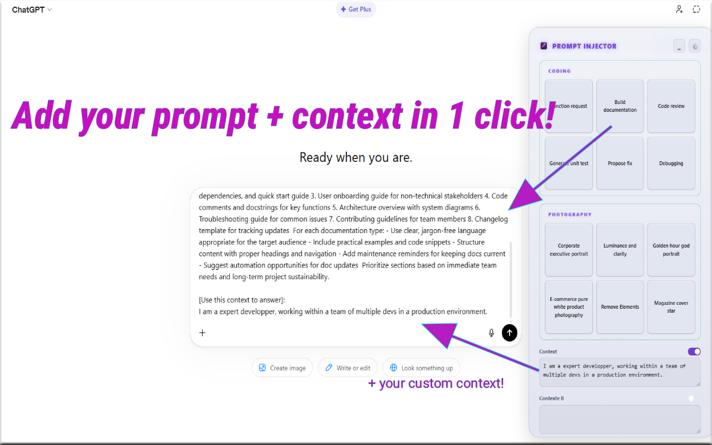
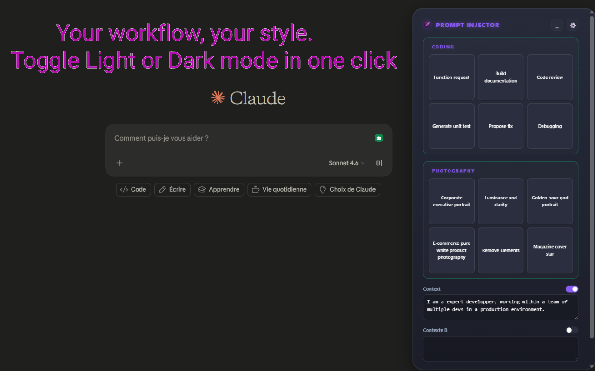
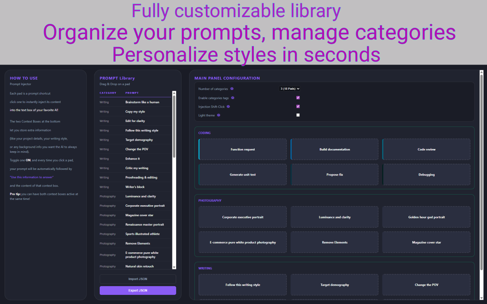
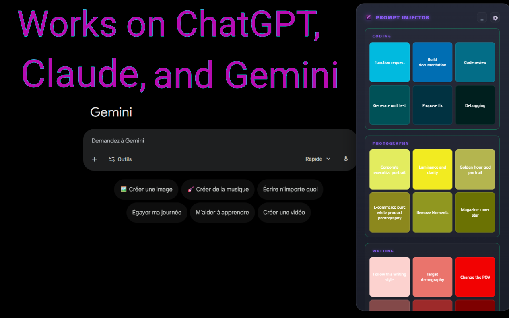

# Prompt_Injector_showcase

# Prompt-Pad: Logic Sampler & Context Injector

**Prompt-Injector** is a specialized Chrome extension designed for high-frequency workflows with Large Language Models (ChatGPT, Claude, Gemini). It solves the mechanical friction of prompt orchestration and context-switching through a persistent, zero-telemetry injection interface.

> **Note:** This repository serves as an architectural showcase. The source code is maintained in a private repository to protect the commercial intellectual property of the licensing and deployment infrastructure.

## ⚙️ System Architecture

The extension is built on a strict local-first topology, prioritizing DOM isolation and structural security.

### 1. Zero-Telemetry & Local State Management
All user configurations, cryptographic license states, and logic libraries are strictly serialized and stored within the browser's native `chrome.storage.local` API. 
* **Data Privacy:** No prompt data is ever routed through external endpoints. 
* **State Mutation:** The application utilizes background listeners to trigger asynchronous DOM rebuilds only when structural state variables mutate, optimizing memory footprint.

### 2. Isolated DOM Interface (Shadow DOM)
To ensure universal compatibility across various host platforms (OpenAI, Anthropic, Google) without CSS bleeding or class collisions, the entire user interface is encapsulated within a closed Shadow DOM. 

### 3. Programmatic Event Dispatching Pipeline
Targeting modern text editors (like ProseMirror or Lexical) requires bypassing standard `.value` assignments. Prompt-Pad utilizes a multi-layered injection pipeline:
1. **Selection Mapping:** Captures the active range and window selection.
2. **Execution:** Attempts native `document.execCommand('insertText')` for graceful degradation.
3. **Event Emulation:** Dispatches customized `InputEvent` (insertText) payloads with bubbling enabled to force React/Vue state listeners on the host page to register the mutation.

### 4. Cross-Origin Resource Sharing (CORS) Delegation
To comply with the strict Content Security Policies (CSP) and `connect-src` directives of AI platforms, network calls (such as cryptographic license validation) are offloaded from the Content Script. Payloads are transmitted via the `chrome.runtime` message bus to the Service Worker (`background.js`), which executes the HTTP requests in an isolated execution context.

## 🚀 Core Mechanics

* **Modular Matrix:** A 24-pad customizable grid divided into 4 categorical matrices.
* **Persistent Context Variables:** Dual background variables (e.g., system prompts, coding standards) that auto-concatenate with the primary payload when toggled active.
* **Shift-Click Append Logic:** Programmatic string concatenation to inject multiple instructions sequentially without overwriting existing textarea data.

## 🔗 Installation

Available for Chromium-based browsers on the [Chrome Web Store](https://chromewebstore.google.com/detail/prompt-pad-llm-prompt-context-injector/[ahkkmkbgaidcffhmaamgmdliinlpcagm]).

## 📺 Visual Demonstration

Click the image below to watch the full architectural walkthrough and workflow demonstration.

*The video demonstrates the Shadow DOM injection, the drag-and-drop logic library, and the seamless integration with ChatGPT, Claude, and Gemini.*
